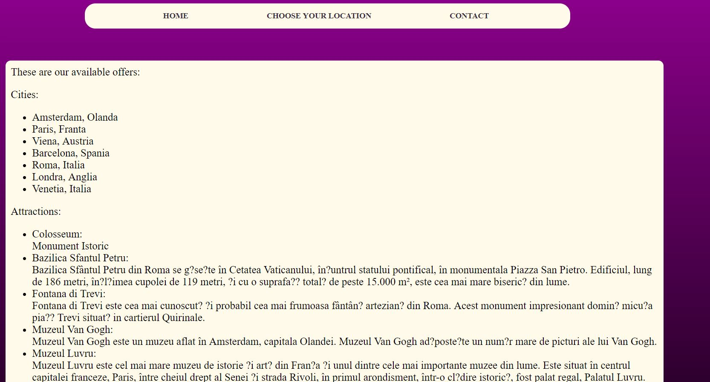

# around-the-world
### Introducere 
------

- Care este principala nevoie/problemă pe care o rezolvă proiectul nostru?

Aplicaţia “Around the World” a fost gândită pentru cei care se întreabă “De unde începe lumea şi unde se termină ea?“, pentru călătorii de pretutindeni care doresc să se elibereze de automatismele cotidiene şi şă descopere noi realităţi. Astfel, aceasta îşi propune să facă parte din ritualul escapadelor, ajutând la găsirea celor mai bune oferte pentru destinaţiile dorite.
“Around the World” pune la dispoziţie toate informţiile de care este nevoie pentru planificarea vacanţei: hoteluri, zboruri, destinații, alături de principalele atracţii turistice, care simplifică procesul de luare a unei decizii în ceea ce priveşte următoarea vacanţă.
Sunt adunate aici cele mai frumoase destinații, întrucât, considerăm găsirea locației perfecte cel mai important aspect în organizarea unei călătorii. Este important pentru clienți să găsească locul potrivit pentru ei, un loc în care se pot dezvolta din punct de vedere cultural, un loc în care se pot relaxa și în care pot gusta din cultura specifică zonei vizitate, dacă acesta este lucrul pe care și-l doresc. Astfel, această aplicaţie poate deveni rapid “paşaportul oricărui călător”.

- Cărui tip de utilizatori se adresează produsul nostru?

Produsul nostru este în esență o aplicație web care pune la dispoziție o alegere variată a unor posibile călătorii memorabile și se adresează în primul rând persoanelor fizice, printre ale căror pasiuni se regăsesc călătoria și descoperirea locurilor noi și pline de istorie. Totodată, se adresează persoanelor, care printr-un simplu click vor să-și planifice vacanța, având la dispoziție toate informațiile necesare despre locul în care vor călători.


- Ce alte produse similare există pe piață?

Pe piață există numeroase aplicații , unele care oferă pachete complete, altele în care îți poți rezerva doar hotelul sau doar zborul. Am realizat un scurt research în urma căruia am descoperit câteva tipuri de aplicații, toate având la bază satisfacerea dorinței clientului de a călători:
- Aplicații specializate pe găsirea și rezervarea locurilor la cazare: hotelscan.com, trivago.ro, hotels.com
- Aplicații care oferă mai mult decât camere la hotel. Ajută clienții să găsească atât bilete de avion la prețuri cât mai avantajoase, cât și închirieri de mașini sau asigurări de călătorie. Ex: booking.com, esky.ro, vola.ro, tripadvisor.com, momondo.ro
De asemenea, există și site-uri web care promovează pachete de vacanță deja organizate de către agenții de turism: tui-travelcenter.ro, citiesbreak.com
Toate aceste site-uri se concentrează pe vânzarea cât mai multor pachete de vacanță, pe rezervarea cât mai multor camere de hotel sau zboruri de avion, adoptând un stil specific promovării unor servicii, stilul comercial. 
Spre deosebire de toate aceste aplicații, ”Around the world” pune la dispoziție un set de informații legate de hoteluri, zboruri, atracții turistice și țările / orașele în care se poate călători. Dacă un utilizator este decis asupra tuturor aspectelor prezentate mai sus, iar destinația dorită se regăsește printre ofertele noastre disponibile, atunci acesta este rugat să completeze un formular cu datele personale. Acest formular ajunge în baza noastră de date, urmând ca mai apoi să fie contactat pentru a discuta următoarele formalități.

### Interfețe aplicație 
------
Începem descrierea prin a specifica faptul că ”Around The World” este o aplicație web single-page. În momentul accesării aplicaţiei, utilizatorului i se deschide pagina și poate începe o frumoasă expediție a găsirii locului perfect pentru călătoria sa. Aici are opțiunea de a naviga printre  informațiile despre ceea ce își propune să realizeze aplicația (Home), informații despre ofertele disponibile (Choose your destination) și despre modalitatea de contact.(Contact)

Home presupune o descriere simplistă a rolului aplicației, menționat deja anterior. 
 

Choose your destination pune la dispoziție ofertele valabile: destinații -țări/orașe, atracții turistice, hoteluri, zboruri sau perioada disponibilă. În urma selectării acestor informații, utilizatorului i se va deschide un formular prin care solicită o finalizare a procesului de rezervare. Acesta este rugat să introducă datele personale în câmpurile speciale : nume, prenume, e-mail și alegerile pentru care a optat. Formularul ajunge în baza noastră de date, urmând ca în cel mai scurt timp, utilizatorul să fie contactat pentru următorii pași.

 

Contact cuprinde date referitoare la adresa sediului nostru, telefon și e-mail.

 

### REST API - exemple de request și răspuns
------

1. **GET /cities** - afișarea destinațiilor pe care utilizatorul le poate alege
- răspuns:
```javascript
locations:
  [
  location1:{ “denumire”: “Londra”}, 
  location2:{“denumire”: “Paris”}, 
  location3:{“denumire”: “Viena”}
  ]
```
2. **GET /location/info** - descrierea obiectivelor turistice în funcție de locația aleasă 
- răspuns: 
```javascript
objectives:
[
    obiectiv1:
    { 
      “denumire”: “London Eye”,
      “descriere”: “o descriere”
    }, 
    obiectiv2:
    {
    “denumire”: “Big Ben”,
    “descriere”:”o descriere”
    }, 
    obiectiv3:
    {
    “denumire”: “Madame Tussaud”,
    “descriere:” “o descriere ”
    }
]
```
3. **GET /location/hotels** - descrierea hotelurilor dintre care utilizatorul poate alege
- răspuns:
```javascript
[
    hotel1:
    { 
        “denumire”: “X”,
        “descriere”: “o descriere”,
        “tarife”: “tarif”,
        “facilitati”:”niste facilitati”,
        “nr stele”: 5,
        “adresa”:”o adresa”
       }, 
    hotel2:
    {
        “denumire”: “Y”,
        “descriere”: “o descriere”,
        “tarife”: “tarif”,
        “facilitati”:”niste facilitati”,
        “nr stele”: 5,
        “adresa”:”o adresa”
        }, 
    hotel3:
    {
        “denumire”: “Z”,
        “descriere”: “o descriere”,
        “tarife”: “tarif”,
        “facilitati”:”niste facilitati”,
        “nr stele”: 5,
        “adresa”:”o adresa”

         }
]
```

4. **GET /location/flights** - lista de zboruri disponibile
- răspuns: 
```javascript
 [
    flight1:
    { 
        “numar zbor”: “X”,
        “pret”: 50,
        “categorie”:”Economy”,
        “destinatie”:”Londra- aeroportul pe care se aterizeaza”,
        “compania aeriana”:”Wizz Air”,
        “locuri”:
          [
            loc1: {“numar”: “34”},
            loc2:{”numar”:”45”}
          ]
       }, 
    flight2:
    {
      “numar zbor”: “Y”,
      “pret”: 50,
      “categorie”:”Economy”,
      “destinatie”:”Londra- aeroportul pe care se aterizeaza”,
      “compania aeriana”:”Wizz Air”,
      “locuri”:
          [
              loc1: {“numar”: “37”},
              loc2:{”numar”:”49”}
          ]

        }, 
    flight3:
    {
        “numar zbor”: “Z”,
        “pret”: 50,
        “categorie”:”Economy”,
        “destinatie”:”Londra- aeroportul pe care se aterizeaza”,
        “compania aeriana”:”Wizz Air”,
        “locuri”:
          [
            loc1: {“numar”: “33”},
            loc2:{”numar”:”45”}
          ]
    }
]

```


